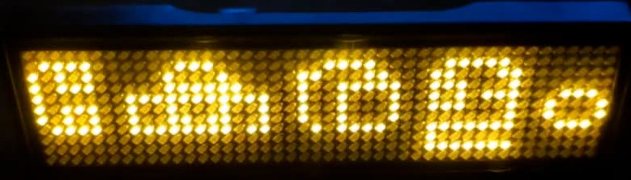
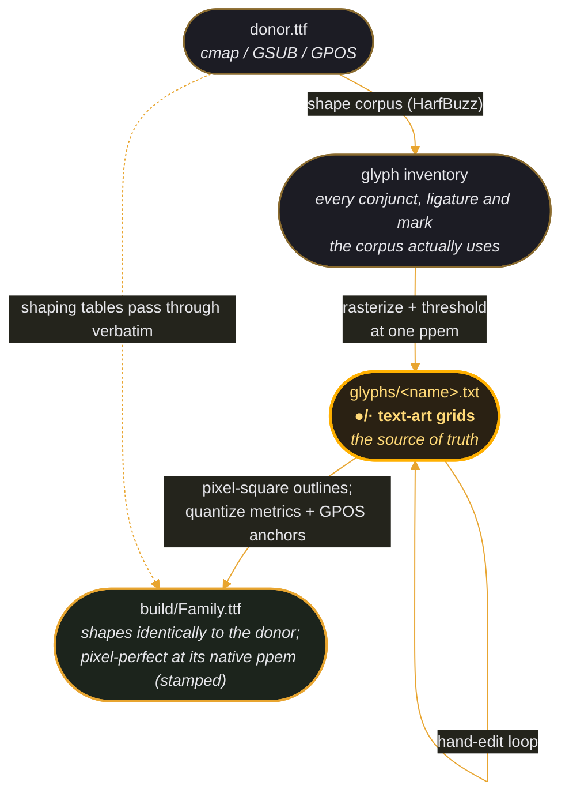

# pixelshaper

**Shaping-aware pixel fonts** — derive hand-tunable pixel fonts from any
OpenType donor, GSUB/GPOS intact.



*Malayalam on an 11-row [FOSSASIA LED name badge](https://badgemagic.fossasia.org/), rendered with
ManjariPixel — a pixel font derived from [Manjari](https://smc.org.in/fonts/manjari)
with its OpenType shaping intact.*

> Status: **design phase.** The pipeline exists and is proven in two
> single-font projects — [manjari-pixel] and [nupuram-pixel], both Malayalam —
> which this project generalizes. See [DESIGN.md](DESIGN.md) for the plan.

## The idea

Outline fonts fail on tiny pixel grids (LED matrices, e-paper tickers,
embedded displays) for a precise reason: below ~12 pixels per em, strokes go
sub-pixel and every edge rounds arbitrarily — **nobody decides which pixel a
stroke owns.** Classic pixel fonts (k8x12, Terminal Vector) solve this by
hand-drawing every glyph on a fixed grid, but they exist only for scripts
where one codepoint is one glyph. Complex scripts — Malayalam, Devanagari,
Arabic — need a *shaping engine* to form conjuncts, reorder vowel signs, and
position marks, and no pixel-font toolchain speaks shaping. Consequently, no
Indic pixel-font ecosystem exists.

pixelshaper's observation: **every shaped form already exists as a discrete
glyph inside a donor font** — GSUB just maps codepoint sequences onto glyph
IDs. So we keep the donor's `cmap`/GSUB/GPOS verbatim and replace only the
glyph *outlines* with pixel squares:



HarfBuzz shapes the result exactly as it shapes the donor. Your pixels,
the donor designer's shaping brain.

## Why text-art glyph files

The source of truth is a directory of plain-text bitmaps — one small
`●`/`·` grid per glyph with a metrics header. Fixing a glyph means editing
characters in any editor and recompiling (seconds). The files diff cleanly
in git, review well, and double as documentation of every hand decision.
Functionally, this hand-tuning is the *hinting* that complex-script fonts
never had — performed once, at the one size that matters, and baked in.

## Provenance

Grown out of rendering Malayalam on an 11-row [FOSSASIA LED name badge](https://badgemagic.fossasia.org/).
The two parent projects remain the working reference implementations and
will become this repo's example projects:

- [manjari-pixel] — ManjariPixel, 14 ppem, from Manjari (SMC)
- [nupuram-pixel] — NupuramPixel, 12 ppem, from Nupuram (SMC)

Derived fonts are licensed under the SIL OFL 1.1. Check each donor's OFL
for Reserved Font Names before naming a family — Manjari, Nupuram and
Noto Sans Malayalam declare none, so donor-based names are used.

[manjari-pixel]: ../manjari-pixel/
[nupuram-pixel]: ../nupuram-pixel/

## Usage

See **[USAGE.md](USAGE.md)** for the full conversion walkthrough — from
license check through trace/build/render to the hand-edit loop — using
the Noto Sans Malayalam example. Working projects live in
[examples/](examples/).

## Commands

Every command takes `-C/--project DIR` (default `.`) pointing at a
directory with a `pixelshaper.toml`. Illustrated with the projects in
[examples/](examples/):

### `pixelshaper trace [--force]`

Shapes every `corpus.txt` line with the donor via HarfBuzz, collects the
glyphs that come out (including conjunct ligatures no codepoint maps to
— Manjari's ക്ത, Mukta's क्ष), rasterizes each at the configured ppem and
threshold, and writes `glyphs/<name>.txt`. Existing files are **skipped**,
which is what makes corpus growth safe: adding തലശ്ശേരി to the Manjari
example traced only the new ശ്ശ ligature and left 70 hand-edited files
untouched. If `ppem` is unpinned it prints a suggestion — the largest
size where the worst corpus line fits `strip_height` rows (14 for
Manjari, 9 for Noto and Mukta on 11 rows: donor proportions in one
number) — pin it in the toml immediately afterwards.

`--force` retraces everything, **destroying hand-edits**. Only safe when
`status` reports `hand-edited: 0` — that's how the Noto example's
threshold was re-swept without loss.

### `pixelshaper build`

Copies the donor, replaces the outlines of every glyph in `glyphs/` with
pixel squares (1 px = upem/ppem units), quantizes advances and all GPOS
coordinates to the grid, renames the family, and stamps the native size
into name-table ID 3 (`ManjariPixel-14px;derived-from-Manjari`). Nothing
else changes — which is why NotoMalayalamPixel and MuktaPixel shape
identically to their donors.

### `pixelshaper render [TEXTS...] [--gap N] [--shared]`

Renders at the native ppem in 1-bit mono (no thresholds — a pixel font
is exact by construction), prints the ●/· grid, and writes a
`strip_height`-tall white-on-black PNG to `build/`, ready for e.g.
[`lednamebadge.py`](https://github.com/fossasia/led-name-badge-ls32) (the Python
tool that writes images to the badge over USB). With no TEXTS it renders
the whole corpus.

Each PNG is named `<family>-<hash>.png` (lowercased family + first 8 hex
chars of the text's MD5, e.g. `manjaripixel-18391f6f.png`), so the same
text always maps to the same file and different texts never collide. The
exact filename is printed in the `=== text (WxH) -> file ===` line above
each grid.

- default placement: each whitespace token gets its own baseline —
  സന്തോഷ് (tall marks) and മലയാളം (deep tails) each use the full strip;
- `--gap N`: blank columns between tokens (8–10 reads well scrolling);
- `--shared`: one baseline for the whole string — used for the alphabet
  strips, where per-token centring makes the row wave.

`WARNING: ink span … exceeds N rows; clipping` is the hand-tuning
worklist, not noise: every Malayalam mark compression in the examples
started as one of these warnings.

### `pixelshaper status`

Coverage report: corpus entries, glyphs needed vs traced vs missing, and
**hand-edited** — detected, not recorded, by re-tracing each glyph in
memory and diffing against the file. It reconstructs the Manjari
example's 54-glyph tuning ledger from the files alone. Note the
corollary: changing `ppem`/`threshold` after tracing makes *everything*
report as edited, because the auto-trace baseline moved — pin your
config.

## Development

```sh
nix develop     # python + uv dev shell with the native libs
```

Tooling stack: HarfBuzz (uharfbuzz), FreeType (freetype-py), fontTools,
numpy, Pillow.
