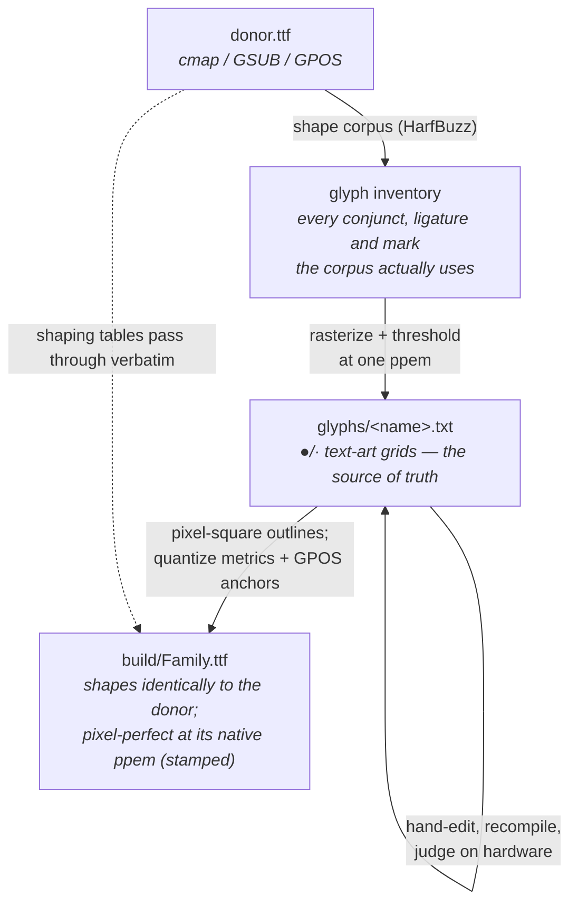

# pixelshaper

**Shaping-aware pixel fonts** — derive hand-tunable pixel fonts from any
OpenType donor, GSUB/GPOS intact.

> Status: **design phase.** The pipeline exists and is proven in two
> single-font projects — [manjari-pixel] and [nupuram-pixel], both Malayalam —
> which this project generalizes. See [DESIGN.md](DESIGN.md) for the plan.

## The idea

Outline fonts fail on tiny pixel grids (LED matrices, e-paper tickers,
embedded displays) for a precise reason: below ~12 pixels per em, strokes go
sub-pixel and every edge rounds arbitrarily — **nobody decides which pixel a
stroke owns.** Classic pixel fonts (k8x12, Terminal Vector) solve this by
hand-drawing every glyph on a fixed grid, but they exist only for scripts
where one codepoint is one glyph. Complex scripts — Malayalam, Devanagari,
Arabic — need a *shaping engine* to form conjuncts, reorder vowel signs, and
position marks, and no pixel-font toolchain speaks shaping. Consequently, no
Indic pixel-font ecosystem exists.

pixelshaper's observation: **every shaped form already exists as a discrete
glyph inside a donor font** — GSUB just maps codepoint sequences onto glyph
IDs. So we keep the donor's `cmap`/GSUB/GPOS verbatim and replace only the
glyph *outlines* with pixel squares:



HarfBuzz shapes the result exactly as it shapes the donor. Your pixels,
the donor designer's shaping brain.

## Why text-art glyph files

The source of truth is a directory of plain-text bitmaps — one small
`●`/`·` grid per glyph with a metrics header. Fixing a glyph means editing
characters in any editor and recompiling (seconds). The files diff cleanly
in git, review well, and double as documentation of every hand decision.
Functionally, this hand-tuning is the *hinting* that complex-script fonts
never had — performed once, at the one size that matters, and baked in.

## Provenance

Grown out of rendering Malayalam on an 11-row FOSSASIA LED name badge.
The two parent projects remain the working reference implementations and
will become this repo's example projects:

- [manjari-pixel] — ManjariPixel, 14 ppem, from Manjari (SMC)
- [nupuram-pixel] — NupuramPixel, 12 ppem, from Nupuram (SMC)

Derived fonts are licensed under the SIL OFL 1.1. Check each donor's OFL
for Reserved Font Names before naming a family — Manjari, Nupuram and
Noto Sans Malayalam declare none, so donor-based names are used.

[manjari-pixel]: ../manjari-pixel/
[nupuram-pixel]: ../nupuram-pixel/

## Usage

See **[USAGE.md](USAGE.md)** for the full conversion walkthrough — from
license check through trace/build/render to the hand-edit loop — using
the Noto Sans Malayalam example. Working projects live in
[examples/](examples/).

## Development

```sh
nix develop     # python + uv dev shell with the native libs
```

Tooling stack: HarfBuzz (uharfbuzz), FreeType (freetype-py), fontTools,
numpy, Pillow.
