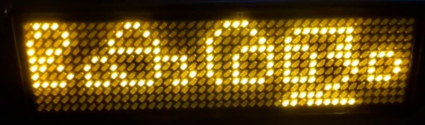
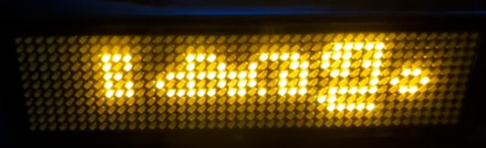
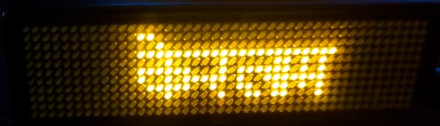

# Examples

Pixel-font projects. The first two are vendored snapshots of
the parent repositories where they were developed glyph by glyph against real
hardware (an 11-row [FOSSASIA LED badge](https://badgemagic.fossasia.org/)):

| Example | Donor | Family | ppem | On the badge | Notes |
|---|---|---|---|---|---|
| `manjari-pixel/` | Manjari Regular (SMC) | ManjariPixel | 14 |  | Geometric, compact — largest em on 11 rows |
| `nupuram-pixel/` | Nupuram Dots (SMC) | NupuramPixel | 12 |  | Round, dotted design; the original experiment |
| `noto-malayalam-pixel/` | Noto Sans Malayalam (Google) | NotoSansMalayalamPixel | 9 |  | The USAGE.md walkthrough project; 40 hand-tuned glyphs. At 9 ppem it does not use the full 11 px height — words render centred with blank rows |
| `mukta-devanagari-pixel/` | Mukta Regular (Ek Type) | MuktaPixel | 9 |  | Devanagari — first non-Malayalam script; auto-trace only. Like Noto, its 9 ppem em does not fill the 11 px height |

Run from the repo root:

```sh
uv run pixelshaper -C examples/manjari-pixel status
uv run pixelshaper -C examples/manjari-pixel build
uv run pixelshaper -C examples/manjari-pixel render "മലയാളം"
```

The `glyphs/` directories contain substantial hand-tuning (open counters,
compressed marks, redrawn conjunct stacks — `pixelshaper status` lists
which glyphs differ from a fresh auto-trace). The living projects remain
in their parent repositories; these snapshots track them loosely.

## Devanagari: `mukta-devanagari-pixel/`

The example that proves the pipeline is script-agnostic: **zero code
changes** were needed to go from Malayalam to Devanagari. 73 glyphs traced
from a corpus of the varnamala, the full matra series on क, common
conjuncts (क्ष त्र ज्ञ श्र द्ध द्य क्त स्त), reph/rakar words (कर्म
प्रेम धर्म) and real words (नमस्ते, भारत, दिल्ली, मुंबई).

```sh
uv run pixelshaper -C examples/mukta-devanagari-pixel render "नमस्ते"
```

Note on size: both 9 ppem fonts (this and Noto) are pinned at their
corpus-driven suggestion, so ordinary words span ~8–9 rows and render
vertically centred rather than filling the 11 px strip. Filling the
height would mean pinning a larger ppem and hand-compressing the
overflowing marks — the treatment ManjariPixel got (pinned 14 against a
suggestion of 10).

Script-specific behaviour, all inherited from Mukta's own GSUB/GPOS:
the **shirorekha** (headline) renders as one continuous lit row with
letters hanging below it; ि reorders before its consonant; the conjuncts
form as ligature glyphs. At 9 ppem on 11 rows Mukta's stems trace to
single pixels at the default 0.35 threshold (unlike Noto, which needed
0.45). Auto-trace only so far — the expected hand-tuning targets are the
ि hook above the headline, the reph, rakar forms, and कृ's tail.

All derived fonts are SIL OFL 1.1 (see `fonts/OFL.txt` in each); the
donors declare no Reserved Font Names, so the families carry the donor
names.
